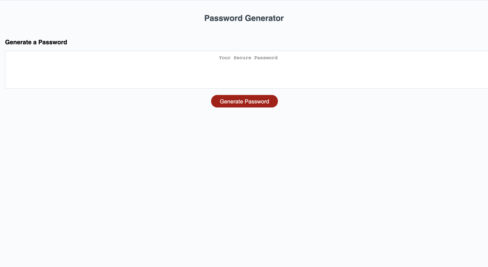

# Password-Generator

## User Story

AS A avid computer user you have grown tired of having to think of new passwords every 30 days for all of your accounts. All of your passwords have to be 8 - 128 characters long and you want to be able to just click a button every 30 days that will create a new password. You need a password that includes 4 different types of characters so that you no longer have to spend an extended amount of time coming up with new passwords. 

## Description 

This is a password generator that will create unlimmted passwords that are 8 - 128 characters in length. The characters will include numbers, special characters, upper case letters, and lower case letters. When the button is clicked an alert will appear that directs the client to select their character limit. If the character limit is below or above the set parameters an "Invalid Response" alert will appear. The client must then click generate password again and after selecting the correct number of characters they will be asked to confirm the use of the 4 different character types. After confirmation the new password will display in a text box on the page. 

## Conclusion 

Passwords will continue to generate every time the button is clicked. Each time the button is clicked the client will have the choice of adjusting the character length and confirming all 4 character choices. 

## Deployed Link 

https://jashawns.github.io/Password-Generator/

## GitHub Location 

https://github.com/Jashawns/Password-Generator.git

## Visuals 

 